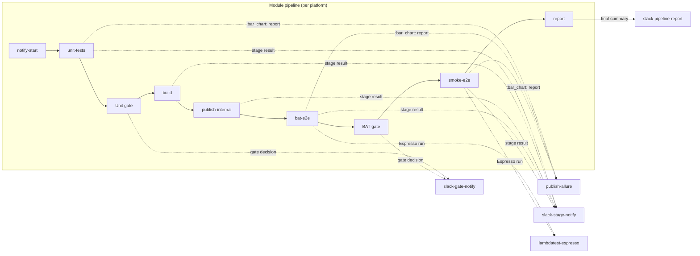

# Reusable Composite Actions

Five composite GitHub Actions that every module pipeline calls. They exist so the per-platform workflows (`stream-qoe-app-api.yml`, `stream-qoe-app-web.yml`, `stream-qoe-app-android.yml`, `stream-qoe-app-ios.yml`) can stay short and identical in shape — all the Slack payload building, Allure publishing, and LambdaTest orchestration lives here exactly once.

The **Quality-by-Design** workshop also adds [`evaluate-jest-gate`](evaluate-jest-gate/) for web-player unit test gating.

## Where each action plugs in



## Inventory

| Action | What it does | Used by |
|---|---|---|
| [`slack-stage-notify`](slack-stage-notify) | Posts a per-stage result message into the pipeline thread (PASSED / FAILED / SKIPPED with duration, pass-rate, and report link) | every stage of every pipeline |
| [`slack-gate-notify`](slack-gate-notify) | Posts a one-line "gate PASSED — proceeding" or "gate FAILED — blocking" reply after a quality gate decision | unit gate, BAT gate |
| [`slack-pipeline-report`](slack-pipeline-report) | Final per-pipeline summary: sends the consolidated module summary to the thread *and* edits the original "build started" header to show the final ✅/❌ verdict | the `report` job at the end of each pipeline |
| [`publish-allure`](publish-allure) | Installs Allure CLI, generates an HTML report from a JUnit/Allure results directory, and pushes it to GitHub Pages with a placeholder fallback | every test stage that produces JUnit/Allure XML |
| [`lambdatest-espresso`](lambdatest-espresso) | Uploads APKs to LambdaTest, dispatches a category-filtered Espresso run, polls until done, and writes JUnit XML where downstream stages expect it | Android BAT and Smoke jobs when `vars.LT_USERNAME` is set |
| [`evaluate-jest-gate`](evaluate-jest-gate) | Fail the gate when npm test outcome is not `success` | QBD `quality-by-design.yaml` web-unit job |

---

## `slack-stage-notify`

Per-stage Slack reply. Builds the payload through `.github/scripts/stage_result_to_slack.py` and sends via `slackapi/slack-github-action@v2.1.1`.

| Input | Required | Default | Notes |
|---|---|---|---|
| `module-name` | yes | — | `API` / `WEB` / `ANDROID` / `iOS` — drives the message header |
| `stage-name` | yes | — | Human label, e.g. `"Unit Tests"` |
| `stage-result` | yes | — | `success` / `failure` / `skipped` / `cancelled` |
| `duration` | no | `''` | Pre-formatted, e.g. `"1m 23s"` |
| `report-url` | no | `''` | Link rendered next to the result (Allure, deployment URL, …) |
| `link-label` | no | `:bar_chart: View Report` | Label for the `report-url` link |
| `thread-ts` | yes | — | Thread captured by `notify-start` so the reply lands in the right thread |
| `junit-dir` | no | `''` | If supplied, pass-rate is computed from XMLs in this directory |
| `playwright-json` | no | `''` | Same idea for Playwright runs |
| `slack-bot-token` | yes | — | `secrets.SLACK_BOT_TOKEN` |
| `slack-channel-id` | yes | — | `secrets.SLACK_CHANNEL_ID` |

```yaml
- name: Notify Slack — Unit result
  if: always()
  uses: ./.github/actions/slack-stage-notify
  with:
    module-name:      WEB
    stage-name:       "Unit Tests (Vitest)"
    stage-result:     ${{ steps.unit.outcome }}
    duration:         ${{ env.UNIT_DURATION }}
    report-url:       https://${{ github.repository_owner }}.github.io/${{ github.event.repository.name }}/allure/${{ github.run_number }}/web/unit
    thread-ts:        ${{ needs.notify-start.outputs.thread_ts }}
    junit-dir:        web-player/test-results
    slack-bot-token:  ${{ secrets.SLACK_BOT_TOKEN }}
    slack-channel-id: ${{ secrets.SLACK_CHANNEL_ID }}
```

---

## `slack-gate-notify`

One-line gate decision. Skips silently when Slack secrets aren't set, so the action is safe to call from forks/PRs without leaking failures.

| Input | Required | Notes |
|---|---|---|
| `gate-passed` | yes | `'true'` or `'false'` |
| `proceed-message` | yes | Slack mrkdwn shown when the gate passes |
| `blocked-message` | yes | Slack mrkdwn shown when the gate fails |
| `thread-ts` | yes | Pipeline thread |
| `slack-bot-token` | yes | `secrets.SLACK_BOT_TOKEN` |
| `slack-channel-id` | yes | `secrets.SLACK_CHANNEL_ID` |

```yaml
- name: Post BAT gate decision to Slack
  if: always() && steps.bat-gate.outputs.gate_passed != 'skipped'
  uses: ./.github/actions/slack-gate-notify
  with:
    gate-passed:      ${{ steps.bat-gate.outputs.gate_passed }}
    proceed-message:  "BAT gate *PASSED* — running Smoke tests…"
    blocked-message:  "BAT gate *FAILED* — Smoke tests and Firebase publish *BLOCKED*."
    thread-ts:        ${{ needs.notify-start.outputs.thread_ts }}
    slack-bot-token:  ${{ secrets.SLACK_BOT_TOKEN }}
    slack-channel-id: ${{ secrets.SLACK_CHANNEL_ID }}
```

---

## `slack-pipeline-report`

End-of-pipeline finalizer. Performs three steps:

1. Injects `thread-ts` into `module-slack-payload.json` (which the report job's Python script writes earlier).
2. Sends that payload as a thread reply (the per-platform summary).
3. Edits the original "build started" header message so the final ✅/❌ + duration shows on the parent message — no need to scroll the thread to know whether the build passed.

| Input | Required | Default | Notes |
|---|---|---|---|
| `thread-ts` | yes | — | Pipeline thread |
| `module-name` | yes | — | `API` / `WEB` / `ANDROID` / `iOS` |
| `build-verdict` | yes | — | `success` / `failure` (drives the ✅/❌ icon in the header edit) |
| `env-label` | no | `STAGE` | Shown in the metadata line — `STAGE` / `PROD` |
| `slack-bot-token` | yes | — | `secrets.SLACK_BOT_TOKEN` |
| `slack-channel-id` | yes | — | `secrets.SLACK_CHANNEL_ID` |

**Pre-condition:** `module-slack-payload.json` must already exist in the working directory. It's written by `.github/scripts/module_result_to_slack.py` (called from the report job before this action).

```yaml
- name: Finalize Slack thread
  uses: ./.github/actions/slack-pipeline-report
  with:
    thread-ts:        ${{ needs.notify-start.outputs.thread_ts }}
    module-name:      ANDROID
    build-verdict:    ${{ needs.smoke-e2e.result == 'success' && 'success' || 'failure' }}
    slack-bot-token:  ${{ secrets.SLACK_BOT_TOKEN }}
    slack-channel-id: ${{ secrets.SLACK_CHANNEL_ID }}
```

---

## `publish-allure`

Generates an Allure HTML report from a results directory and pushes it to the `gh-pages` branch under the requested sub-path.

Hardening:

- **Always succeeds** — if `results-src` is empty/missing, a placeholder HTML page is published so the report URL never 404s.
- **Cached CLI** — Allure 2.29.0 is cached per OS, so re-runs install instantly.
- **Concurrent-deploy safe** — the underlying [`JamesIves/github-pages-deploy-action`](https://github.com/JamesIves/github-pages-deploy-action) wrapper retries 6 times with exponential back-off + random jitter so parallel Allure publishes from sibling jobs (BAT + Smoke + Unit running in the same workflow) don't trample each other on `gh-pages`.

| Input | Required | Default | Notes |
|---|---|---|---|
| `stage-title` | yes | — | Shown on the placeholder page; also the report's name |
| `results-src` | yes | — | Directory of Allure JSON / JUnit XML to feed `allure generate` |
| `pages-destination` | yes | — | Sub-path on `gh-pages`, e.g. `allure/${{ github.run_number }}/web/unit` |
| `github-token` | yes | — | `secrets.GITHUB_TOKEN` |
| `allure-epic` | no | `''` | Behaviors top-level group (e.g. `"Android Player E2E"`) — used when JUnit XML is converted via `junit_to_allure.py` |
| `allure-feature` | no | `''` | Behaviors mid-level (e.g. `"Build Acceptance Tests"`) |
| `allure-tag` | no | `''` | Tag chip (`BAT` / `Smoke` / `Regression` / `Unit`) |
| `allure-language` | no | `''` | `kotlin` / `swift` / `java` / `typescript` |

Convention for the `pages-destination` path so URLs stay stable and discoverable:

```
allure/<run-number>/<platform>/<stage>
allure/42/web/unit
allure/42/web/bat
allure/42/android/smoke
allure/42/api/regression
```

```yaml
- name: Generate & deploy BAT Allure report
  if: always()
  uses: ./.github/actions/publish-allure
  with:
    stage-title:       "Android BAT"
    results-src:       android-player/app/build/outputs/androidTest-results/connected
    pages-destination: allure/${{ github.run_number }}/android/bat
    github-token:      ${{ secrets.GITHUB_TOKEN }}
    allure-epic:       "Android Player E2E"
    allure-feature:    "Build Acceptance Tests"
    allure-tag:        "BAT"
    allure-language:   "kotlin"
```

---

## `lambdatest-espresso`

Drop-in replacement for the local emulator path on `ubuntu-latest` runners. Uploads the app + androidTest APK, fires the build via the LambdaTest REST API, polls until done, and writes the JUnit XML report into `output-dir` so the downstream `publish-allure` and gate-evaluation steps work unchanged.

| Input | Required | Default | Notes |
|---|---|---|---|
| `lt-username` | yes | — | `vars.LT_USERNAME` |
| `lt-access-key` | yes | — | `secrets.LT_ACCESS_KEY` |
| `app-apk` | yes | — | Path to `app-debug.apk` |
| `test-apk` | yes | — | Path to `app-debug-androidTest.apk` |
| `annotation` | yes | — | JUnit category FQCN — `com.devopsdays.qoe.player.categories.BAT` etc. |
| `build-name` | yes | — | Shown in the LambdaTest dashboard |
| `device` | no | `Pixel 6 Pro-13` | Override via `vars.LT_DEVICE_ANDROID` |
| `output-dir` | yes | — | Directory the JUnit XML is written to (consumed by `publish-allure`) |
| `region` | no | `us` | `us` / `eu` / `in` |
| `poll-interval` | no | `20` | Seconds between status polls |
| `max-poll-minutes` | no | `20` | Hard cap; beyond this the run is treated as "device unavailable" so the soft-gate path triggers instead of a hard fail |

| Output | Description |
|---|---|
| `build_id` | LambdaTest build ID — useful for cross-linking dashboards |
| `dashboard_url` | Direct link to the LambdaTest build dashboard |

```yaml
- name: Run BAT on LambdaTest (real device)
  id: bat-lt
  if: vars.LT_USERNAME != ''
  continue-on-error: true
  uses: ./.github/actions/lambdatest-espresso
  with:
    lt-username:    ${{ vars.LT_USERNAME }}
    lt-access-key:  ${{ secrets.LT_ACCESS_KEY }}
    app-apk:        android-player/app/build/outputs/apk/debug/app-debug.apk
    test-apk:       android-player/app/build/outputs/apk/androidTest/debug/app-debug-androidTest.apk
    annotation:     com.devopsdays.qoe.player.categories.BAT
    build-name:     "Android BAT — Build #${{ github.run_number }}"
    device:         ${{ vars.LT_DEVICE_ANDROID || 'Pixel 6 Pro-13' }}
    output-dir:     android-player/app/build/outputs/androidTest-results/connected
    region:         ${{ vars.LT_REGION || 'us' }}
```

---

## Conventions

- **Composite, not Docker.** All five actions are `using: composite` so they run inline in the calling job — no container start-up overhead, full access to checked-out files.
- **Slack secrets are optional.** Every Slack action gates its API call on `inputs.slack-bot-token != ''` so jobs in forks/PRs that can't see secrets don't fail noisily.
- **Soft-gating downstream.** Actions that wrap external services (LambdaTest, GitHub Pages, Slack) use `continue-on-error: true` on the network step so a flaky third-party never breaks the build verdict — failures surface as a missing report or a missing message, not a red pipeline.
- **Python for payload building.** Every action that builds a Slack payload calls a script from [`.github/scripts/`](../scripts/) (`stage_result_to_slack.py`, `update_build_message.py`, etc.) instead of inlining JSON in shell. Keeps the action YAML readable and the payload logic testable.

## Adding a new composite action

1. Create `.github/actions/<your-name>/action.yml` — define `name`, `description`, `inputs`, optional `outputs`, and `runs.using: composite`.
2. If the action shells out to Python, drop the script in `.github/scripts/` and invoke it via `python3 .github/scripts/<your-script>.py`.
3. Reference it from a workflow as `uses: ./.github/actions/<your-name>` (note the leading `./` — without it Actions looks on Marketplace).
4. Add a row to the **Inventory** table above and a per-action section with the input/output table and a usage snippet.
