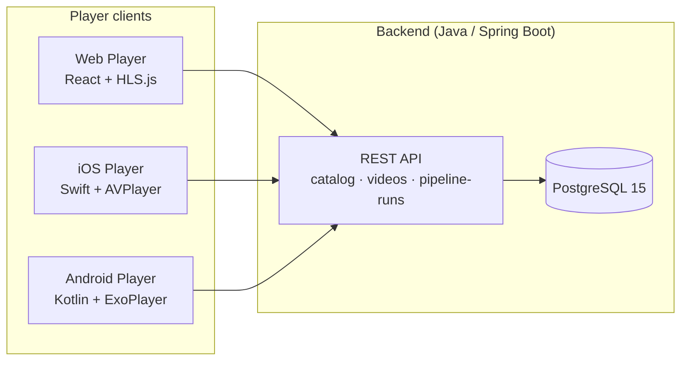
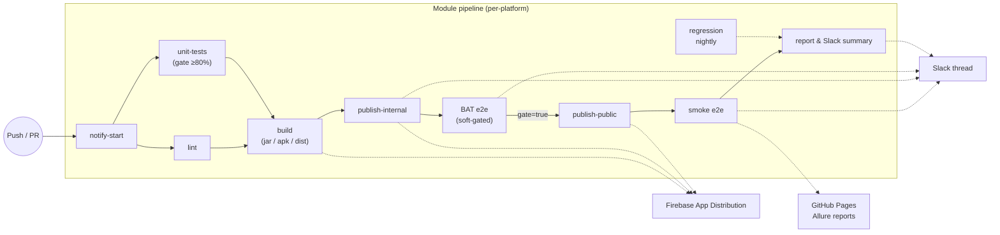

# Quality by Design: Embedding DevSecOps and Test Automation into CI/CD

> **PlatformCon 2026** · Theme 2: Platform Engineering in Practice

A hands-on workshop repo: reusable GitHub Actions workflow templates, security-by-default checks, ephemeral test environments, and enforceable quality gates — demonstrated on a **streaming app** (web, iOS, Android, API).

| | |
|---|---|
| **Workshop guide** | [`docs/WORKSHOP-GUIDE.md`](docs/WORKSHOP-GUIDE.md) |
| **Gate chain** | `unit → contract → integration → ephemeral env → smoke → perf smoke → promote` (+ DevSecOps in parallel) |
| **Orchestrator** | [`.github/workflows/quality-by-design.yaml`](.github/workflows/quality-by-design.yaml) |
| **CFP submission** | [`docs/SUBMISSION.md`](docs/SUBMISSION.md) |

Teams rarely lack tests or security — they lack **consistency**. This repo shows how to turn DevSecOps and test automation into CI/CD defaults instead of one-off pipelines per team.

## Quick start

```bash
docker compose up -d
cd backend-api && ./gradlew unitTest contractTest batTest
cd ../web-player && npm test
```

| Service | URL |
|---|---|
| Web Player | http://localhost:3000 |
| Backend API | http://localhost:8080 |
| Swagger UI | http://localhost:8080/swagger-ui/index.html |

See [`QUICKSTART.md`](QUICKSTART.md) and [`docs/WORKSHOP-GUIDE.md`](docs/WORKSHOP-GUIDE.md) for the full hands-on script.

---

## Sample apps — streaming app demo

Cross-platform streaming video app with a shared backend, catalog API, multi-stage tests, and per-platform CI/CD pipelines.

## Architecture

The player clients share a single backend API and a common CI/CD pattern for build, test, and release.



## CI/CD pipeline shape

Each module owns its own GitHub Actions workflow. Pipelines all follow the same gated shape — *test → build → ship a canary → re-validate → promote* — with threaded Slack notifications and Allure reports published to GitHub Pages along the way.



The Web and API pipelines use Firebase Hosting (preview channel → live promotion); the Android and iOS pipelines use Firebase App Distribution (internal canary → public promotion). On a hard BAT failure the public promotion is blocked but the internal release stays live so the team can investigate on the same artifact testers are running.

**Mobile E2E paths.** Both Android and iOS pipelines support two ways to run BAT/Smoke instrumented tests:

| Mode | Selected when | Where it runs |
|---|---|---|
| **LambdaTest cloud device** | `vars.LT_USERNAME` is set on the repo | Real Pixel/iPhone hardware on LambdaTest |
| **Self-hosted emulator/simulator** | `vars.LT_USERNAME` is unset | KVM-accelerated x86_64 AVD on `ubuntu-latest` (Android) / Xcode simulator on `macos-latest` (iOS) |

**Workshop escape hatches.** Mobile device labs are flaky; these flags keep the rest of the pipeline shipping when the lab is down:

| Variable | Effect |
|---|---|
| `vars.SKIP_BAT=true` *or* `[skip-bat]` in commit/PR title | Skip BAT entirely for one run; Firebase publishes on the Unit gate alone |
| `vars.NO_DEVICE_LAB=true` | Persistent override — BAT reports `SKIPPED` (not `FAILED`) so Slack stays green |
| `inputs.skip_tests=true` | Hotfix mode — bypass every gate, ship straight to public |

## Modules

| Module | Description | README |
|---|---|---|
| [`backend-api/`](backend-api/README.md) | Java 21 / Spring Boot 3 REST API + PostgreSQL | Setup, endpoints, test commands |
| [`web-player/`](web-player/README.md) | React + TypeScript + HLS.js player | Setup, E2E tests, Allure reports |
| [`ios-player/`](ios-player/README.md) | Swift Package library + SwiftUI demo app | Library usage, Xcode build, Firebase deploy |
| [`android-player/`](android-player/README.md) | Kotlin / ExoPlayer Android app | Android Studio setup, APK build |
| [`qoe-automation-tests/`](qoe-automation-tests/README.md) | Java / TestNG cross-platform automation | API, web, and mobile tests |
| [`ops/`](ops/README.md) | Infrastructure, monitoring, shared schema | nginx, FFmpeg, New Relic, JSON schema |

## Project structure

```
├── backend-api/                 # Spring Boot REST API + Flyway + Testcontainers
├── web-player/                  # React/Vite SPA + Playwright E2E
├── ios-player/                  # SwiftPM library (QoePlayer) + SwiftUI demo app
├── android-player/              # Gradle (Kotlin DSL) Android app + Espresso
├── qoe-automation-tests/        # Maven/TestNG cross-platform suite
├── ops/
│   ├── infrastructure/          # nginx config, FFmpeg HLS transcoder, tc network sim
│   ├── monitoring/              # New Relic dashboards, alerts, NRQL
│   └── shared/schema/           # Shared JSON schema + TS types
├── platform/                    # QBD scripts, policy, smoke/k6 tests
├── docs/                        # PlatformCon workshop docs
├── presentations/               # DevOpsDays slide materials (reference)
├── test-videos/                 # Sample HLS streams (gitignored placeholder)
├── docker-compose.yml           # Full local stack (api + web + db + nginx)
├── QUICKSTART.md                # 5-minute smoke test
├── TESTING.md                   # Per-module test playbook
└── .github/
    ├── workflows/               # QBD + per-module pipelines
    ├── scripts/                 # Slack payload builders + Allure helpers
    └── actions/                 # Reusable composite actions
```

## Quick start

### Prerequisites

| Tool | Min version | Used by |
|---|---|---|
| Docker Desktop | 24+ | full stack |
| Java JDK | **21+** | `backend-api` and `qoe-automation-tests` |
| Node.js | 18+ | `web-player` |
| Maven | 3.9+ | `qoe-automation-tests` |
| Allure CLI | 2.27+ | viewing test reports — `brew install allure` |
| Xcode | 15+ | `ios-player` (macOS only) |
| Android Studio | Hedgehog or later | `android-player` |

### One-line bring-up

```bash
docker compose up -d && curl http://localhost:8080/actuator/health
```

| Service | URL |
|---|---|
| Backend API | http://localhost:8080 |
| API docs (Swagger UI) | http://localhost:8080/swagger-ui/index.html |
| Web Player | http://localhost:3000 |
| nginx (video CDN) | http://localhost:8081 |
| PostgreSQL | localhost:5432 |

For the 5-minute "is everything working?" walkthrough see [`QUICKSTART.md`](QUICKSTART.md). For the full per-module test playbook (unit / BAT / Smoke / Regression and Allure local serving) see [`TESTING.md`](TESTING.md).

## CI/CD workflows

All workflows live in [`.github/workflows/`](.github/workflows/).

| Workflow | Trigger | Module |
|---|---|---|
| **`quality-by-design.yaml`** | push / PR on `backend-api/**`, `web-player/**`, `platform/**` | **PlatformCon QBD workshop** — full gate chain + DevSecOps |
| `streaming-app-api.yml` | push / PR on `backend-api/**` | Backend API |
| `streaming-app-web.yml` | push / PR on `web-player/**` | Web Player |
| `streaming-app-android.yml` | push / PR on `android-player/**` | Android Player |
| `streaming-app-ios.yml` | push / PR on `ios-player/**` | iOS Player |
| `streaming-app-newrelic.yml` | push / PR on monitoring config | New Relic dashboards / alerts |
| `streaming-app-release.yml` | manual | All modules — acceptance + release |
| `shared-notify-build-started.yml` | `workflow_call` | Reusable "build started" Slack notify |
| `reusable-devsecops.yaml` | `workflow_call` | Gitleaks · npm audit · SBOM · Trivy · Conftest |
| `reusable-test-gates.yaml` | `workflow_call` | unit → contract → integration (BAT) |
| `reusable-ephemeral-validation.yaml` | `workflow_call` | Docker Compose stack + smoke + k6 perf smoke |

### Quality by Design workshop (PlatformCon 2026)

The [`platform/`](platform/) folder and [`quality-by-design.yaml`](.github/workflows/quality-by-design.yaml) workflow add the **platform golden path** on top of these sample apps:

```
unit → contract → integration (BAT) → ephemeral env → smoke → perf smoke → promote
              ↕
        DevSecOps defaults (parallel)
```

- **Contract tests:** `./gradlew contractTest` in `backend-api` (`ApiContractIT.java`)
- **DevSecOps:** [`platform/scripts/`](platform/scripts/) + [`reusable-devsecops.yaml`](.github/workflows/reusable-devsecops.yaml)
- **Ephemeral env:** full `docker compose` stack per PR validation
- **Workshop docs:** [`docs/WORKSHOP-GUIDE.md`](docs/WORKSHOP-GUIDE.md) · [`docs/QUALITY-BY-DESIGN.md`](docs/QUALITY-BY-DESIGN.md) · [`docs/ARCHITECTURE.md`](docs/ARCHITECTURE.md) · [`docs/ADOPTION.md`](docs/ADOPTION.md)

Reusable composite actions in [`.github/actions/`](.github/actions/README.md):

| Action | Purpose |
|---|---|
| `slack-stage-notify` | Per-stage Slack message (PASSED / FAILED / SKIPPED + duration + report link) |
| `slack-gate-notify` | "Gate PASSED — proceeding" / "Gate FAILED — blocking" gate decision |
| `slack-pipeline-report` | Final per-platform summary with combined pass rate and total duration |
| `publish-allure` | Generate Allure report from JUnit XML and deploy to GitHub Pages with retry/jitter |
| `evaluate-jest-gate` | Enforceable web unit test gate (QBD orchestrator) |
| `lambdatest-espresso` | Upload APKs + dispatch + poll a LambdaTest Espresso run, normalise JUnit XML output |

Pipeline hardening:

- **Maven Central mirror** baked into Android Gradle setup — falls through to Google's CDN when MC throttles GitHub Actions runners.
- **Gradle dep cache** is written from feature branches so the build job primes cache for downstream BAT/Smoke jobs.
- **3-attempt retry** with 30 s back-off on each on-emulator `connectedDebugAndroidTest` invocation.
- **Allure publish** retries 6 times with exponential back-off + random jitter to survive concurrent GitHub Pages deploys from parallel jobs.

## License

Educational use — PlatformCon 2026 Quality by Design workshop.
