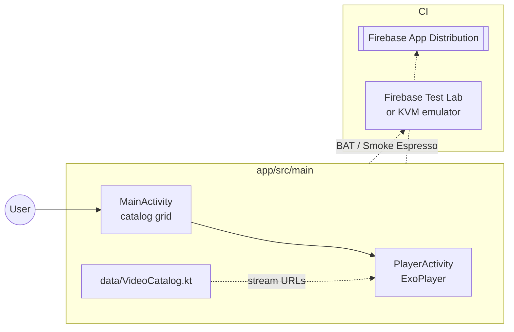

# Android Player

Kotlin Android app using Media3 / ExoPlayer for HLS playback and catalog navigation.

## Tech stack

| Layer | Technology |
|---|---|
| Language | Kotlin |
| Video | ExoPlayer (Media3) |
| UI | RecyclerView catalog + `PlayerActivity` |
| Build | Gradle (Kotlin DSL) |
| Min SDK | Android 8.0 (API 26) |
| Target SDK | Android 14 (API 34) |
| Test | JUnit 4 + MockK (unit), Espresso (instrumented) |
| Reports | Allure (via JUnit XML) |

## Module architecture



## Setup

```bash
# Open in Android Studio: File → Open → android-player/
cd android-player
./gradlew installDebug
```

The catalog uses bundled HLS URLs from `VideoCatalog.kt`. No backend is required for local playback.

## Tests

| Suite | Command | CI annotation |
|---|---|---|
| Unit | `./gradlew test` | JUnit4 job |
| BAT | `./gradlew connectedDebugAndroidTest -Pandroid.testInstrumentationRunnerArguments.annotation=com.devopsdays.qoe.player.categories.BAT` | Firebase Test Lab / emulator |
| Smoke | same with `.categories.Smoke` | after public Firebase promote |
| Regression | same with `.categories.Regression` | nightly / manual |

See [`TESTING.md`](../TESTING.md) and [`docs/FIREBASE-SETUP.md`](../docs/FIREBASE-SETUP.md).

## Project layout

```
android-player/
├── app/src/main/java/com/devopsdays/qoe/player/
│   ├── MainActivity.kt
│   ├── PlayerActivity.kt
│   ├── data/VideoCatalog.kt
│   └── ui/StreamCatalogAdapter.kt
└── app/src/androidTest/.../e2e/   # BAT · Smoke · Regression
```
