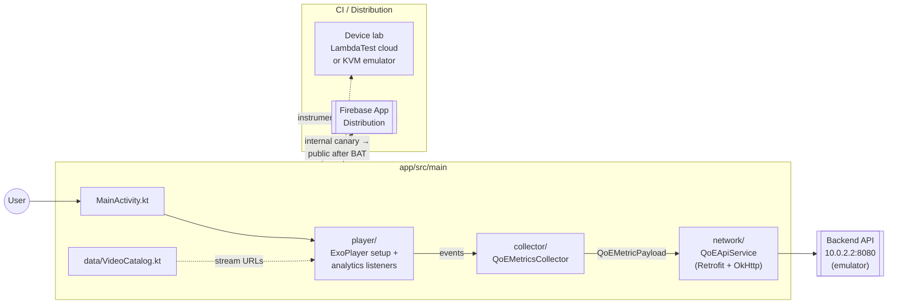
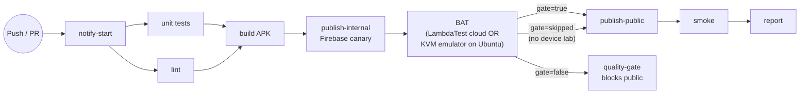

# Android Player

Kotlin Android app using Media3 / ExoPlayer for HLS playback with real-time QoE metrics collection.

## Tech stack

| Layer | Technology |
|---|---|
| Language | Kotlin |
| Video | ExoPlayer (Media3) |
| UI | Jetpack Compose / XML layouts |
| Build | Gradle (Kotlin DSL) |
| Min SDK | Android 8.0 (API 26) |
| Target SDK | Android 14 (API 34) |
| Test | JUnit 4 + MockK (unit), Espresso (instrumented) |
| Reports | Allure (via JUnit XML) |

## Module architecture



## Prerequisites

- Android Studio Hedgehog (2023.1) or later
- Android SDK API 34
- JDK 17+
- Backend API running (see root [`docker-compose.yml`](../docker-compose.yml))

## Setup

```bash
# Open in Android Studio
File → Open → select the android-player/ directory
```

Wait for Gradle sync to complete.

### Configure the API URL

Open `app/src/main/java/com/devopsdays/qoe/android/network/QoEApiService.kt` and pick the right base URL:

| Environment | URL |
|---|---|
| Android emulator on the same host | `http://10.0.2.2:8080/api/v1` |
| Physical device on the same Wi-Fi | `http://<your-machine-ip>:8080/api/v1` |

### Run the app

From Android Studio press **Run** (Shift+F10), or from the CLI:

```bash
cd android-player
./gradlew installDebug
```

## Tests

```bash
./gradlew test                       # JUnit 4 unit tests
./gradlew testDebugUnitTest          # debug variant only — faster
./gradlew connectedDebugAndroidTest  # Espresso (needs device/emulator)
./gradlew lint                       # Android Lint
./gradlew assembleDebug              # → app/build/outputs/apk/debug/app-debug.apk
./gradlew assembleRelease            # release APK (requires signing)
```

The CI pipeline uses Espresso `@Category` filters to gate stages: BAT then Smoke then Regression. Run a single category locally with:

```bash
./gradlew connectedDebugAndroidTest -PtestStage=bat
./gradlew connectedDebugAndroidTest -PtestStage=smoke
```

## CI pipeline (stream-qoe-app-android.yml)



The runner picks LambdaTest if `vars.LT_USERNAME` is set, otherwise a KVM-accelerated Android emulator on `ubuntu-latest`. A soft gate handles "no device available" — the pipeline reports SKIPPED and Firebase deploy proceeds on the Unit gate alone.

## Firebase App Distribution (manual)

The CI pipeline publishes automatically. For local distribution:

```bash
cd android-player
FIREBASE_APP_ID=<your-app-id> ./deploy-firebase.sh
```

Prerequisites: `firebase-tools` installed and `firebase login` completed.

## Project structure

```
android-player/
├── app/
│   └── src/
│       ├── main/
│       │   ├── java/com/devopsdays/qoe/player/
│       │   │   ├── MainActivity.kt              # Entry point
│       │   │   ├── player/                      # ExoPlayer + analytics listener
│       │   │   ├── collector/                   # Metrics collector
│       │   │   ├── network/                     # Retrofit API client
│       │   │   └── data/VideoCatalog.kt         # Stream catalog (used by tests)
│       │   └── res/                             # Layouts, drawables, strings
│       ├── test/                                # JUnit 4 unit tests + MockK
│       └── androidTest/                         # Espresso instrumented tests
│                                                # @Category(BAT|Smoke|Regression)
├── build.gradle.kts
├── settings.gradle.kts
└── deploy-firebase.sh
```

## QoE metrics collected

Every 5 seconds the app sends a payload to `POST /api/v1/metrics` including:

- Platform: `android`
- Video ID + session ID
- Device info (model, OS version, screen resolution)
- Playback state (playing / paused / buffering / error)
- Current time + duration
- Buffering events + total buffering time
- Current bitrate + resolution + bitrate switch count
- Quality score (excellent / good / fair / poor)

_(CI pipeline validation: documentation-only edit on branch `demo/actions-pipeline-smoke`.)_
