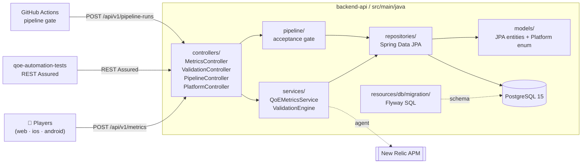

# Backend API

Java 21 / Spring Boot 3 REST API for the streaming app — catalog, videos, and pipeline acceptance gate.

## Tech stack

| Layer | Technology |
|---|---|
| Runtime | Java 21, Spring Boot 3.2 |
| Database | PostgreSQL 15 + Flyway migrations |
| Docs | Springdoc OpenAPI / Swagger UI |
| Testing | JUnit 5, Mockito, REST Assured, Testcontainers |
| Reports | Allure |
| Build | Gradle 8 |
| Observability | New Relic APM (optional) |

## Module architecture

Three layers — **controllers** (HTTP), **services** (business logic + validation), **repositories** (Spring Data JPA over PostgreSQL). The pipeline subsystem is a thin gate API that records per-platform run results and returns a verdict.



## Prerequisites

- Java 21+ (`brew install --cask temurin@21` on macOS)
- Docker + Docker Compose (for PostgreSQL and Testcontainers-based E2E)

## Setup

```bash
docker compose up postgres -d        # start the database only
cd backend-api
./gradlew bootRun                    # runs on http://localhost:8080
```

Swagger UI: **http://localhost:8080/swagger-ui/index.html** — try every endpoint interactively.

## API endpoints

| Method | Path | Description |
|---|---|---|
| `POST` | `/api/v1/metrics` | Ingest a QoE metric payload |
| `GET` | `/api/v1/metrics/{videoId}` | Query metrics for a video |
| `GET` | `/api/v1/platforms` | List supported platforms (filter `?category=`) |
| `POST` | `/api/v1/validations` | Create a validation rule |
| `POST` | `/api/v1/validations/{id}/run` | Run a validation |
| `GET` | `/api/v1/validations/{id}/results` | Get validation results |
| `POST` | `/api/v1/pipeline-runs` | Start a pipeline acceptance run |
| `POST` | `/api/v1/pipeline-runs/{id}/platforms` | Record a platform result |
| `GET` | `/api/v1/pipeline-runs/{id}` | Get pipeline run verdict |
| `GET` | `/actuator/health` | Health check |

## Tests

The build defines **per-stage** Gradle tasks so the local commands mirror the CI pipeline shape (Unit → BAT → Smoke → Regression).

| Stage | Tag | Gradle task | Needs Docker? |
|---|---|---|---|
| Unit | `@Tag("unit")` | `unitTest` | no |
| Contract | `@Tag("contract")` | `contractTest` | yes (Testcontainers) |
| BAT | `@Tag("BAT")` | `batTest` | yes (Testcontainers) |
| Smoke | `@Tag("Smoke")` | `smokeTest` | yes |
| Regression | `@Tag("Regression")` | `regressionTest` | yes |
| All E2E | `@Tag("e2e")` | `e2eTest` | yes |
| Allure (per stage) | — | `allureReport{Unit,Bat,Smoke,Regression,E2e}` | n/a |

```bash
./gradlew unitTest                                # fast Mockito tests, no Docker
./gradlew contractTest                            # API contract / OpenAPI shape (QBD gate)
./gradlew batTest allureReportBat                 # BAT + Allure
./gradlew e2eTest allureReportE2e                 # full E2E + report
./gradlew cleanAll                                # classes + Allure results + reports
allure serve build/allure-results/bat --port 5052 # view BAT report
```

See [`TESTING.md`](../TESTING.md) for the full local pipeline simulation.

## Docker image

```bash
cd backend-api
docker build -t qoe-backend .
```

The Dockerfile runs `unitTest` during the build (fast, no Docker-in-Docker needed) — E2E runs separately in CI once the stack is up.

## Environment variables

| Variable | Default | Description |
|---|---|---|
| `SPRING_DATASOURCE_URL` | `jdbc:postgresql://localhost:5432/qoe_db` | PostgreSQL JDBC URL |
| `SPRING_DATASOURCE_USERNAME` | `qoe_user` | DB username |
| `SPRING_DATASOURCE_PASSWORD` | `qoe_password` | DB password |
| `NEWRELIC_ENABLED` | `false` | Enable New Relic agent |
| `NEWRELIC_LICENSE_KEY` | — | New Relic license key |

## Project structure

```
backend-api/
├── src/main/java/com/devopsdays/qoe/api/
│   ├── config/          # CORS, OpenAPI, Web MVC, ObjectMapper
│   ├── controllers/     # REST controllers
│   ├── models/          # JPA entities + Platform enum
│   ├── repositories/    # Spring Data JPA
│   ├── services/        # Business logic + validation
│   └── pipeline/        # Acceptance-gate domain
├── src/main/resources/
│   ├── application.yml  # App configuration
│   └── db/migration/    # Flyway SQL migrations
├── src/test/java/
│   ├── unit/            # @Tag("unit") — JUnit 5 + Mockito
│   └── e2e/             # @Tag("e2e") — REST Assured + Testcontainers
├── Dockerfile
└── build.gradle
```
