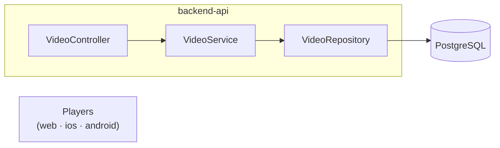

# Backend API

Java 21 / Spring Boot 3 REST API for the streaming workshop — video catalog and health checks.

## Tech stack

| Layer | Technology |
|---|---|
| Runtime | Java 21, Spring Boot 3.2 |
| Database | PostgreSQL 15 + Flyway migrations |
| Docs | Springdoc OpenAPI / Swagger UI |
| Testing | JUnit 5, Mockito, REST Assured, Testcontainers |
| Reports | Allure |
| Build | Gradle 8 |
| Observability | New Relic APM (optional, off by default) |

## Architecture



## Setup

```bash
docker compose up postgres -d
cd backend-api
./gradlew bootRun    # http://localhost:8080
```

Swagger UI: **http://localhost:8080/swagger-ui/index.html**

## API endpoints

| Method | Path | Description |
|---|---|---|
| `GET` | `/api/v1/videos` | List active videos (optional `?category=`) |
| `GET` | `/api/v1/videos/search?q=` | Search videos |
| `GET` | `/api/v1/videos/{id}` | Get one video by `videoId` |
| `GET` | `/api/v1/videos/{id}/manifest` | HLS/DASH manifest URLs |
| `POST` | `/api/v1/videos` | Create a video |
| `PUT` | `/api/v1/videos/{id}` | Update a video |
| `DELETE` | `/api/v1/videos/{id}` | Soft-delete a video |
| `GET` | `/actuator/health` | Health check |
| `GET` | `/v3/api-docs` | OpenAPI contract |

## Gradle test tasks

| Task | Tag | Purpose |
|---|---|---|
| `./gradlew unitTest` | `@Tag("unit")` | Fast unit tests |
| `./gradlew contractTest` | `@Tag("contract")` | API contract (Testcontainers) |
| `./gradlew batTest` | `@Tag("BAT")` | Integration / BAT |
| `./gradlew smokeTest` | `@Tag("Smoke")` | Post-deploy smoke |
| `./gradlew test` | all | Full suite |

See [`TESTING.md`](../TESTING.md) for the full local playbook.

## Configuration

| Variable | Default | Description |
|---|---|---|
| `SPRING_DATASOURCE_URL` | `jdbc:postgresql://localhost:5432/qoe_db` | JDBC URL |
| `NEWRELIC_ENABLED` | `false` | Enable New Relic Java agent |
| `NEWRELIC_LICENSE_KEY` | — | New Relic license key |

## Project layout

```
backend-api/
├── src/main/java/com/devopsdays/qoe/api/
│   ├── controllers/VideoController.java
│   ├── services/VideoService.java
│   ├── models/Video.java
│   └── repositories/VideoRepository.java
├── src/main/resources/db/migration/   # Flyway SQL
└── src/test/java/                   # unit · contract · BAT · smoke

<!-- ci: triggers streaming-app-api.yml on PR -->
```
