# Application & Pipeline Architecture

Visual reference for the **streaming app** runtime and **Quality by Design** CI/CD pipelines in this repo.

Related: [`ARCHITECTURE.md`](ARCHITECTURE.md) (gate policy & lessons) · [`WORKSHOP-GUIDE.md`](WORKSHOP-GUIDE.md) (hands-on script)

> **Module pipeline (per-platform)** — see the diagram in [README.md](../README.md#cicd-pipeline-shape) and §6–§8 below.

---

## 1. End-to-end overview

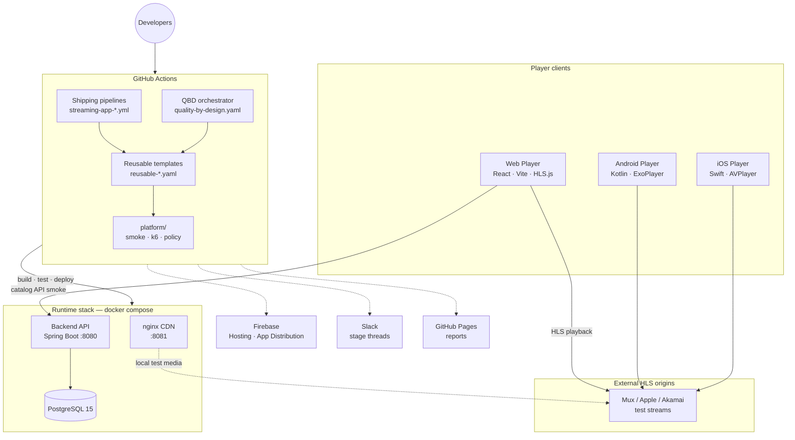

---

## 2. Application architecture

### 2.1 Logical components

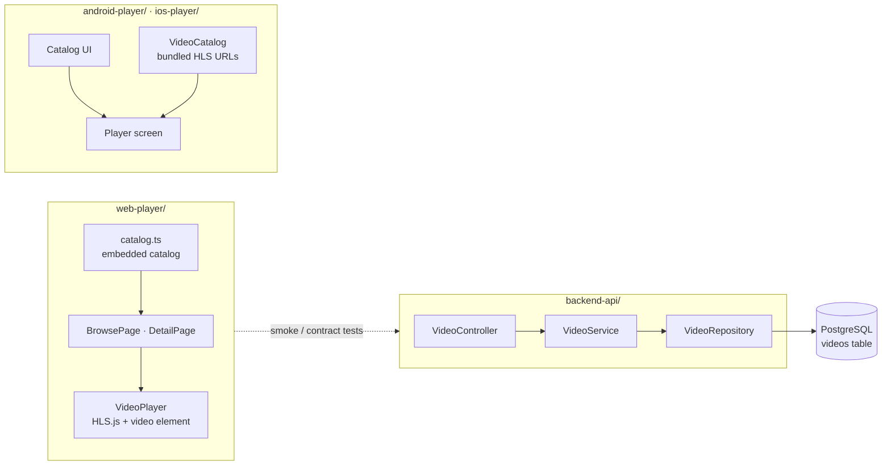

| Component | Responsibility | Backend required? |
|-----------|----------------|-------------------|
| **backend-api** | REST catalog (`/api/v1/videos`), health, OpenAPI | — |
| **web-player** | Browse UI, HLS playback, Playwright E2E | Optional locally; validated in CI smoke |
| **android-player** | RecyclerView catalog, ExoPlayer | No — bundled `VideoCatalog.kt` |
| **ios-player** | SwiftUI catalog, AVPlayer (`StreamApp` package) | No — bundled `VideoCatalog.swift` |

### 2.2 API surface

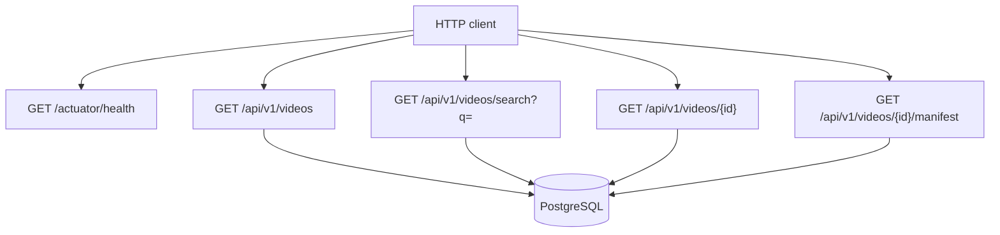

### 2.3 Video playback data flow

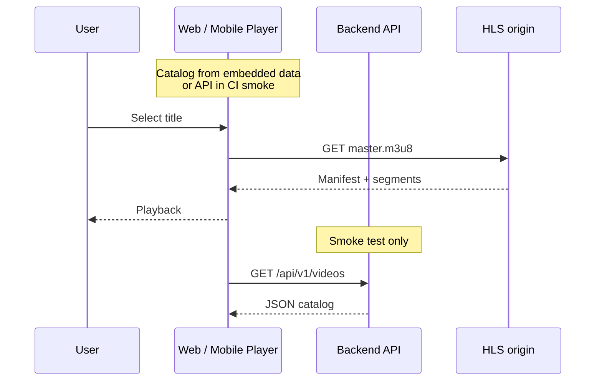

---

## 3. Docker Compose runtime

Local and CI ephemeral environments use the same `docker-compose.yml`.

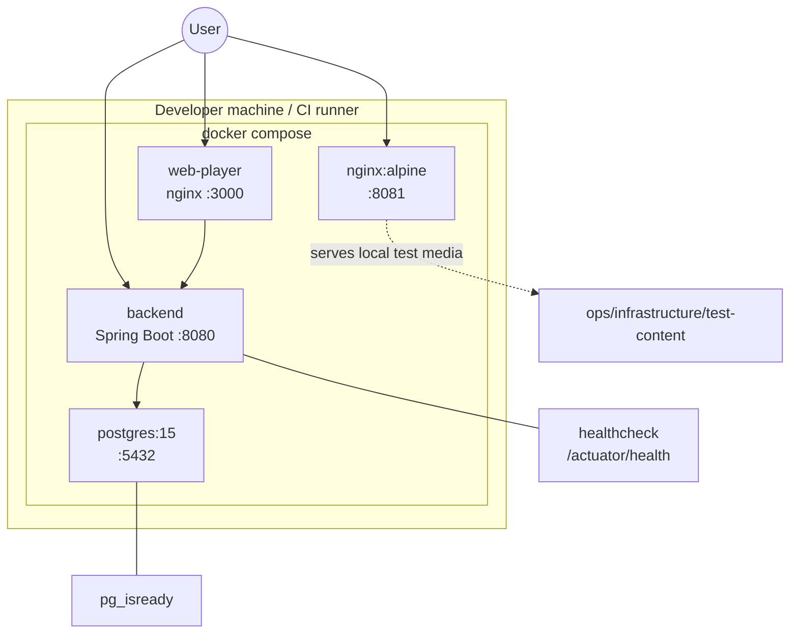

| Service | Port | URL |
|---------|------|-----|
| **backend** | 8080 | http://localhost:8080 |
| **web-player** | 3000 | http://localhost:3000 |
| **postgres** | 5432 | `jdbc:postgresql://localhost:5432/qoe_db` |
| **nginx** | 8081 | http://localhost:8081/videos/ |

---

## 4. CI/CD platform layers

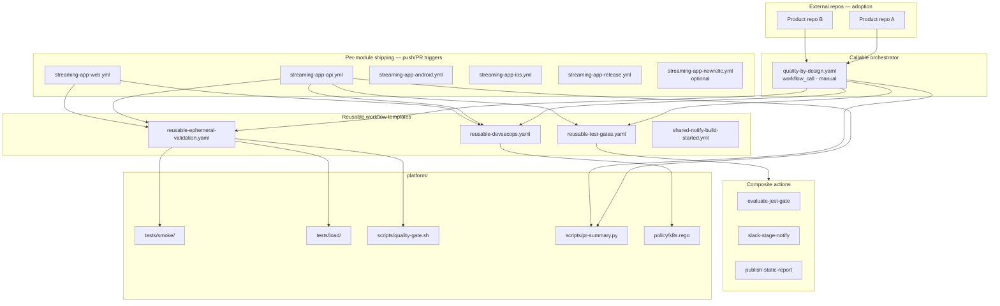

---

## 5. Golden path gate chain

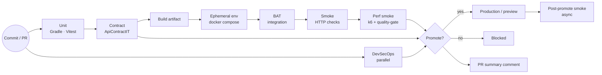

---

## 6. API pipeline (`streaming-app-api.yml`)

Triggered on `backend-api/**`, `platform/**`, `docker-compose.yml`.

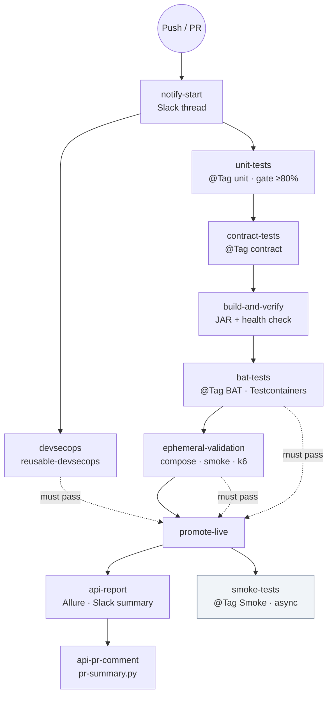

| Job | Blocking? | Test tag / tool |
|-----|-----------|-----------------|
| devsecops | Yes | Gitleaks, Trivy, Conftest, SBOM |
| unit-tests | Yes | `@Tag("unit")` |
| contract-tests | Yes | `@Tag("contract")` |
| build-and-verify | Yes | Spring Boot health |
| bat-tests | Yes | `@Tag("BAT")` |
| ephemeral-validation | Yes | smoke-test.sh + k6 |
| promote-live | Gate | All upstream green |
| smoke-tests | No | `@Tag("Smoke")` post-promote |

---

## 7. Web pipeline (`streaming-app-web.yml`)

Triggered on `web-player/**`, `platform/**`.

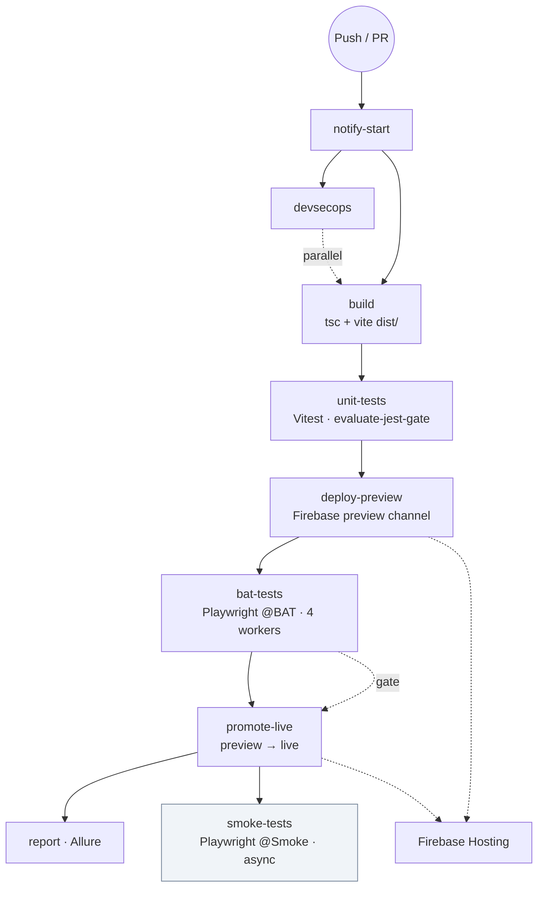

Playwright BAT runs against the **real Firebase preview URL** — not localhost.

---

## 8. Mobile pipelines

### Android (`streaming-app-android.yml`)

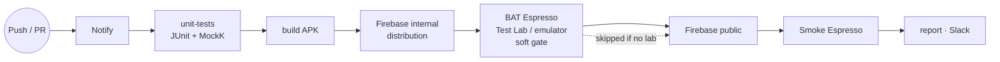

### iOS (`streaming-app-ios.yml`)

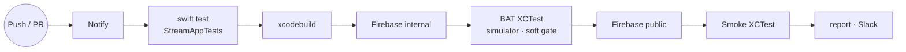

Mobile apps use **bundled catalog URLs** — pipelines focus on build, distribution, and instrumented UI tests.

---

## 9. QBD orchestrator (`quality-by-design.yaml`)

Callable via `workflow_call` or `workflow_dispatch` — **not** triggered on push/PR in this repo. Day-to-day gates live in API/Web shipping pipelines.

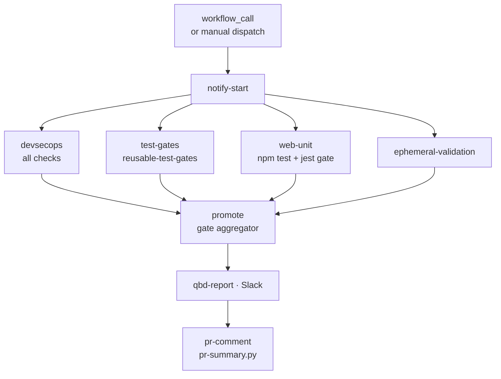

**Adoption pattern:**

```yaml
jobs:
  quality:
    uses: your-org/platform/.github/workflows/quality-by-design.yaml@v1
    secrets: inherit
```

---

## 10. Ephemeral validation flow

`reusable-ephemeral-validation.yaml` — **Full-Stack Smoke + Perf**

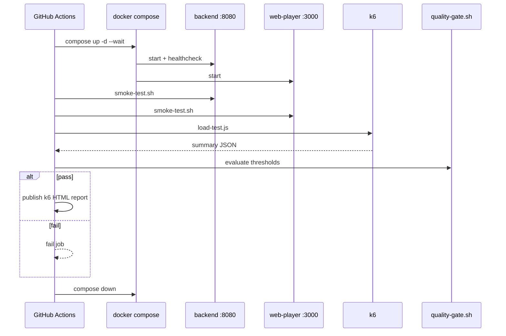

---

## 11. DevSecOps module scoping

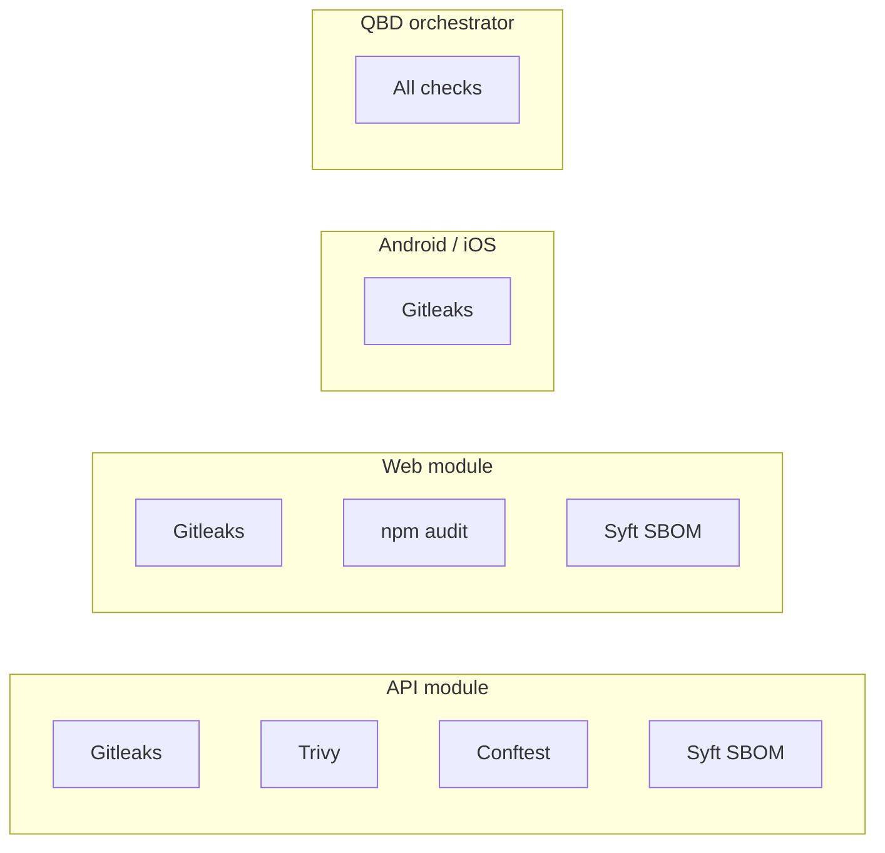

Implementation: `.github/scripts/devsecops_checks.py` + `reusable-devsecops.yaml`

---

## 12. Optional integrations

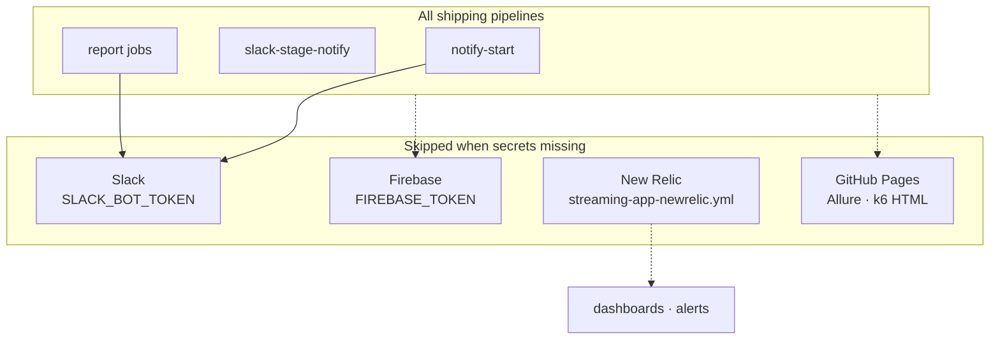

| Integration | Setup doc |
|-------------|-----------|
| Slack threaded stages | [`SLACK-SETUP.md`](SLACK-SETUP.md) |
| Firebase Hosting / App Distribution | [`FIREBASE-SETUP.md`](FIREBASE-SETUP.md) |
| GitHub Pages reports | [`GITHUB-PAGES-SETUP.md`](GITHUB-PAGES-SETUP.md) |

---

## 13. Repository map

```
platform/
├── backend-api/              Spring Boot API + Gradle test tiers
├── web-player/               React app + Vitest + Playwright
├── android-player/           Kotlin + Espresso tiers
├── ios-player/               Swift package + XCTest tiers
├── platform/                 smoke · k6 · policy · scripts
├── docker-compose.yml        ephemeral runtime stack
├── ops/infrastructure/       nginx · HLS tooling
└── .github/
    ├── workflows/
    │   ├── quality-by-design.yaml       orchestrator
    │   ├── reusable-*.yaml              platform templates
    │   └── streaming-app-*.yml          shipping pipelines
    ├── actions/                         composite steps
    └── scripts/                         Slack · Allure · DevSecOps helpers
```

---

## Rendering these diagrams

- **GitHub** — Mermaid renders natively in Markdown preview
- **VS Code / Cursor** — Markdown Preview Mermaid Support extension
- **Export** — [Mermaid Live Editor](https://mermaid.live) or `mmdc` CLI for PNG/SVG slides

For workshop slides, key diagrams are also referenced in [`presentations/01-main-deck.md`](../presentations/01-main-deck.md).
