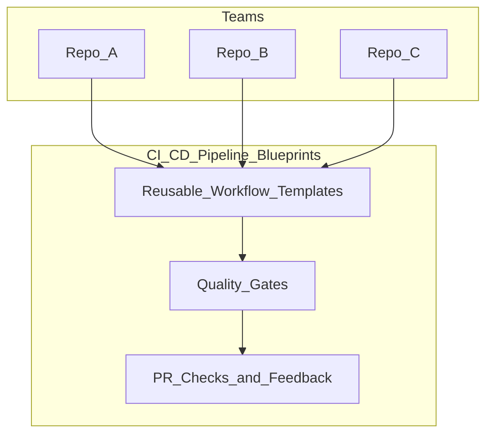
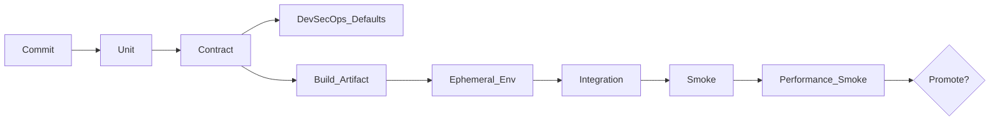
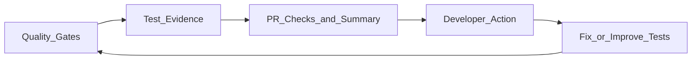
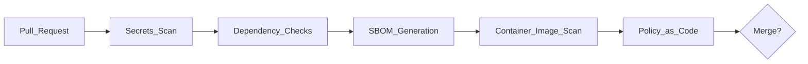

# Architecture — Quality by Design (DevSecOps + Test Automation in CI/CD)

> **Full application + pipeline diagrams:** [`APP-PIPELINE-ARCHITECTURE.md`](APP-PIPELINE-ARCHITECTURE.md) — runtime stack, Docker Compose, per-module CI/CD job graphs, golden path, and optional integrations.

## System overview

## Golden path: standard pipeline stages

### What goes where (practical defaults)

| Stage | Purpose | Runs on | Goal |
|------|---------|---------|------|
| Unit | fast feedback | every push/PR | correctness of code |
| Contract | prevent breaking changes | every PR | API compatibility |
| DevSecOps defaults | reduce security drift | every PR | secrets/deps/SBOM/policy |
| Integration | validate dependencies | PR and main | real-world interaction |
| Smoke | validate deploy correctness | ephemeral env | “it works” checks |
| Perf smoke | catch obvious regressions | ephemeral env | latency/error thresholds |

### Ephemeral environments

**CI (default):** Docker Compose stack per PR — see [`reusable-ephemeral-validation.yaml`](../.github/workflows/reusable-ephemeral-validation.yaml).

**Optional (advanced):** K8s namespace-per-PR via [`platform/scripts/create-env.sh`](../platform/scripts/create-env.sh) and [`platform/env/backend.yaml`](../platform/env/backend.yaml).

### Minimal contract for platform-managed checks

| Contract | Endpoint | Required |
|---------|----------|----------|
| Liveness | `GET /actuator/health` | ✅ |
| Readiness | `GET /actuator/health/readiness` | ✅ |
| Metrics | `GET /actuator/prometheus` | ✅ (recommended) |
| Web root | `GET /` (web-player) | ✅ |

## Quality gates and feedback

## DevSecOps-by-default (built into the platform)

Implementation: [`.github/workflows/reusable-devsecops.yaml`](../.github/workflows/reusable-devsecops.yaml)

## Reference implementation

All sample apps and the canonical pipeline live in this repo:

| Workshop item | Location |
|---------------|----------|
| Sample apps | `backend-api`, `web-player`, `android-player`, `ios-player` |
| QBD orchestrator | `.github/workflows/quality-by-design.yaml` |
| Reusable templates | `.github/workflows/reusable-*.yaml` |
| DevSecOps + policy | `platform/` |
| Ephemeral env (compose) | `docker-compose.yml` |
| Shipping pipelines | `.github/workflows/streaming-app-*.yml` |
| PR feedback | `platform/scripts/pr-summary.py` |
| Perf threshold script | `platform/scripts/quality-gate.sh` |

Gate orchestration patterns adapted from `.github/workflows/streaming-app-api.yml`.

### What to keep in the critical path (what worked)
- Secrets scanning and dependency checks (fast, high value)
- Policy-as-code checks for K8s manifests (label/resource limits/no latest)

### What to run async (what worked)
- Full container image scans and deep SAST (longer runtime)
- Scheduled “fleet-wide” SBOM review jobs

### Lessons learned (no fluff)
- **What worked**: simple gates, clear ownership, stable environments, short perf smokes, and release-notes for pipeline changes.
- **What didn’t**: flaky E2E in the critical path, “one template for everything,” unversioned pipeline breaking changes, and ticket-based onboarding.
