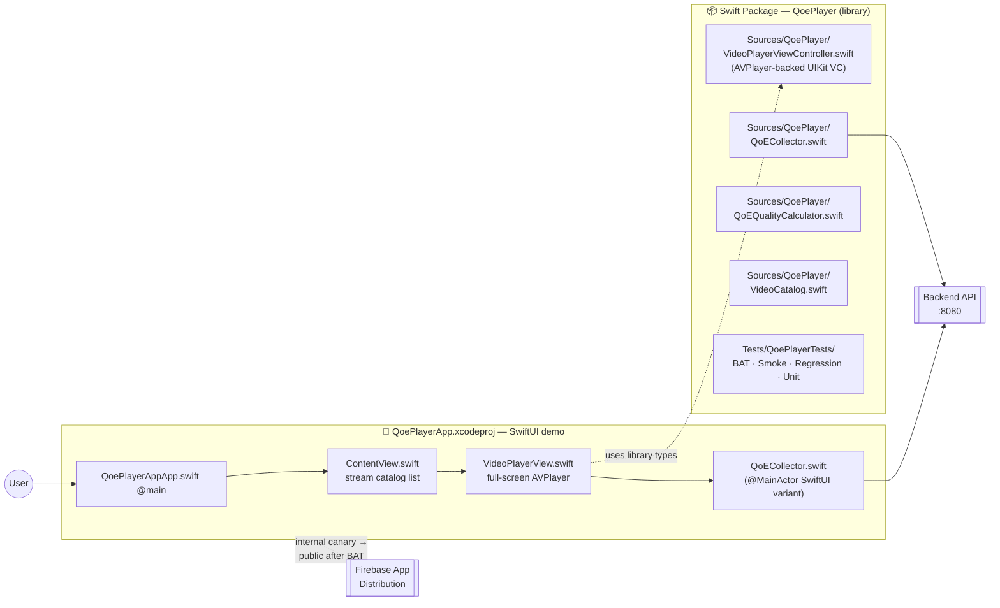
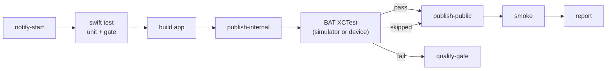

# iOS Player

iOS video player module containing both a reusable Swift Package library (`QoePlayer`) and a runnable SwiftUI demo app.

## Module architecture

The Swift Package exports the reusable `VideoPlayerViewController` + `QoECollector` for any UIKit/SwiftUI host. The Xcode project (`QoePlayerApp`) is a SwiftUI demo that consumes the library and wraps it in a stream-catalog UI.



## Structure

```
ios-player/
├── Package.swift                       # Swift Package (QoePlayer library + tests)
├── Sources/QoePlayer/
│   ├── QoECollector.swift              # Core metrics collector (UIKit)
│   ├── QoEQualityCalculator.swift      # Quality scoring
│   ├── VideoCatalog.swift              # Stream catalog used by tests
│   └── VideoPlayerViewController.swift # AVPlayer-backed UIKit view controller
├── Tests/QoePlayerTests/               # XCTest — BAT/Smoke/Regression/Unit
├── QoePlayerApp/                       # SwiftUI demo app sources
│   ├── QoePlayerAppApp.swift           # @main app
│   ├── ContentView.swift               # Stream catalog list
│   ├── VideoPlayerView.swift           # Full-screen player
│   └── QoECollector.swift              # SwiftUI-optimised collector
├── QoePlayerApp.xcodeproj              # Xcode project
└── deploy-firebase.sh                  # Manual Firebase App Distribution
```

## Library — Swift Package

The `QoePlayer` package exposes `VideoPlayerViewController` and `QoECollector` for any iOS project via Swift Package Manager.

### Add as a dependency

In `Package.swift`:

```swift
.package(path: "../ios-player")
```

Or in Xcode: **File → Add Package Dependencies → choose local path.**

### Usage

```swift
import QoePlayer

let playerVC = VideoPlayerViewController()
playerVC.videoURL  = URL(string: "https://test-streams.mux.dev/x36xhzz/x36xhzz.m3u8")
playerVC.videoId   = "ios-demo-1"
playerVC.apiBaseURL = "http://localhost:8080/api/v1"
present(playerVC, animated: true)
```

### Run library tests

```bash
cd ios-player
swift test                                              # all
swift test --filter QoePlayerTests.BATTests             # BAT only
swift test --xunit-output ios-junit.xml                 # JUnit XML for CI
```

## Demo app — Xcode project

`QoePlayerApp.xcodeproj` is a SwiftUI workshop demo with a stream catalog and full-screen HLS playback.

### Build / run on simulator

```bash
cd ios-player
xcodebuild \
  -project QoePlayerApp.xcodeproj \
  -scheme QoePlayerApp \
  -destination 'platform=iOS Simulator,name=iPhone 15' \
  build
```

Or open `QoePlayerApp.xcodeproj` in Xcode and press **Run**.

### Run Xcode tests

```bash
xcodebuild test \
  -project QoePlayerApp.xcodeproj \
  -scheme QoePlayerApp \
  -destination 'platform=iOS Simulator,name=iPhone 15' \
  | xcpretty --report html --output build/reports/tests/index.html
```

### Deploy to Firebase App Distribution (manual)

The CI pipeline distributes automatically. For local one-off uploads:

```bash
cd ios-player
FIREBASE_APP_ID=<your-app-id> APPLE_TEAM_ID=<your-team-id> ./deploy-firebase.sh
```

## CI pipeline (streaming-app-ios.yml)

The shape mirrors the Android pipeline — soft-gated BAT, two-tier Firebase distribution.



## Configuration

| Setting | Location | Default |
|---|---|---|
| API base URL (library) | `VideoPlayerViewController.apiBaseURL` | `http://localhost:8080/api/v1` |
| API base URL (app) | `QoePlayerApp/QoECollector.swift` → `apiBase` | `http://localhost:8080/api/v1` |

For a physical device replace `localhost` with your Mac's local IP address.

_(CI pipeline validation: documentation-only edit on branch `demo/actions-pipeline-smoke`.)_
