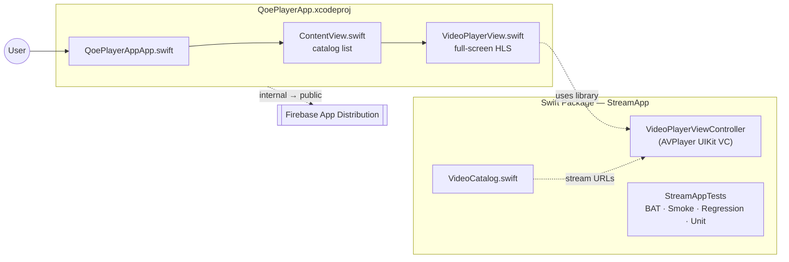

# iOS Player

iOS video player module containing a reusable Swift Package library (`StreamApp`) and a runnable SwiftUI demo app (`QoePlayerApp`).

## Module architecture



## Structure

```
ios-player/
├── Package.swift
├── Sources/StreamApp/
│   ├── VideoCatalog.swift
│   └── VideoPlayerViewController.swift
├── Tests/StreamAppTests/
├── QoePlayerApp/                    # SwiftUI demo sources
├── QoePlayerApp.xcodeproj
└── deploy-firebase.sh
```

## Library — Swift Package

### Usage

```swift
import StreamApp

let playerVC = VideoPlayerViewController()
playerVC.videoURL = URL(string: "https://test-streams.mux.dev/x36xhzz/x36xhzz.m3u8")
playerVC.videoId  = "ios-demo-1"
present(playerVC, animated: true)
```

### Run library tests

```bash
cd ios-player
swift test
swift test --filter StreamAppTests.BATTests
swift test --xunit-output ios-junit.xml
```

## Demo app — Xcode project

```bash
cd ios-player
xcodebuild -project QoePlayerApp.xcodeproj -scheme QoePlayerApp \
  -destination 'platform=iOS Simulator,name=iPhone 15' build
```

Or open `QoePlayerApp.xcodeproj` in Xcode and press **Run**.

### Firebase App Distribution (manual)

```bash
FIREBASE_APP_ID=<app-id> APPLE_TEAM_ID=<team-id> ./deploy-firebase.sh
```

## CI (`streaming-app-ios.yml`)

Unit tests → build → Firebase internal → BAT (simulator, soft gate) → public promote → smoke → report.

See [`docs/FIREBASE-SETUP.md`](../docs/FIREBASE-SETUP.md).

<!-- ci: triggers streaming-app-ios.yml on PR -->
