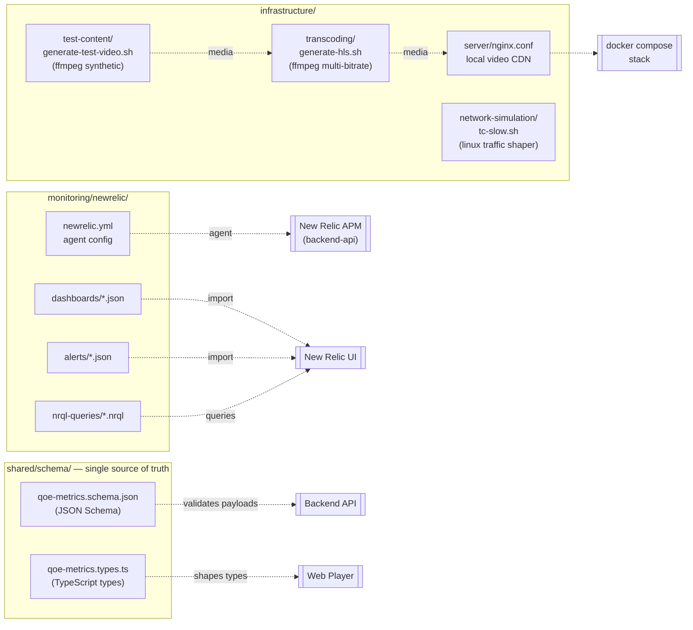

# Ops

Workshop utility resources covering local streaming infrastructure, observability, and the canonical QoE schema shared by every player.

## Layout



```
ops/
├── infrastructure/                  # Local streaming infrastructure
│   ├── server/nginx.conf                    # Nginx video CDN config
│   ├── transcoding/generate-hls.sh          # FFmpeg HLS transcoder
│   ├── test-content/generate-test-video.sh  # Synthetic test video generator
│   └── network-simulation/tc-slow.sh        # Linux traffic shaper
├── monitoring/newrelic/             # Observability config
│   ├── newrelic.yml
│   ├── dashboards/                  # Importable dashboard JSON
│   ├── alerts/                      # Alert policy JSON
│   └── nrql-queries/                # Useful NRQL queries
└── shared/schema/                   # Canonical QoE metric contract
    ├── qoe-metrics.schema.json
    └── qoe-metrics.types.ts
```

---

## Infrastructure

### Generate a synthetic test video (FFmpeg required)

```bash
cd ops/infrastructure/test-content
./generate-test-video.sh output.mp4 30      # 30-second test video
```

### Transcode to HLS multi-bitrate streams

```bash
cd ops/infrastructure/transcoding
./generate-hls.sh /path/to/input.mp4 /path/to/output-dir
```

Produces 1080p / 720p / 480p HLS streams with a `master.m3u8` playlist.

### Serve videos locally with nginx

The `server/nginx.conf` is wired up automatically by Docker Compose:

```bash
docker compose up nginx -d
# Videos served at http://localhost:8081/videos/
```

Or manually:

```bash
nginx -c $(pwd)/ops/infrastructure/server/nginx.conf
```

### Simulate a slow network (Linux only — requires root)

Useful for deliberately triggering buffering events to validate QoE collection.

```bash
cd ops/infrastructure/network-simulation
sudo ./tc-slow.sh eth0 1mbit 100ms 1%
#                  ^     ^      ^    ^ packet loss
#                  |     |      latency
#                  |     bandwidth
#                  network interface
```

Reset:

```bash
sudo tc qdisc del dev eth0 root
```

---

## Monitoring (New Relic)

### Agent setup

Copy `newrelic.yml` into your application directory and set your license key:

```bash
cp ops/monitoring/newrelic/newrelic.yml backend-api/
# Set NEW_RELIC_LICENSE_KEY env var or edit newrelic.yml directly
```

### Import dashboards / alerts

1. Dashboards: **New Relic → Dashboards → Import dashboard** → paste the JSON from `dashboards/`.
2. Alerts: apply via the New Relic API or `nr1` CLI, e.g.

```bash
nr1 nerdgraph:query --file ops/monitoring/newrelic/alerts/high-buffering.json
```

### NRQL queries

`monitoring/newrelic/nrql-queries/qoe-metrics.nrql` includes ready-to-use queries:

- Average startup time by platform
- Buffering rate over time
- Error rate by video ID
- Quality score distribution

---

## Shared schema

The canonical definition of the QoE metric payload — every player imports types from these files, the API validates payloads against the JSON Schema, and the database columns track the same shape.

### Validate a payload

```bash
npx ajv validate -s ops/shared/schema/qoe-metrics.schema.json -d your-payload.json
```

### Use the TypeScript types

```typescript
import type { QoEMetricPayload } from '../../ops/shared/schema/qoe-metrics.types'
```

When the schema changes, update both files in lock-step **and** add a Flyway migration in `backend-api/src/main/resources/db/migration/` if database columns are affected.
