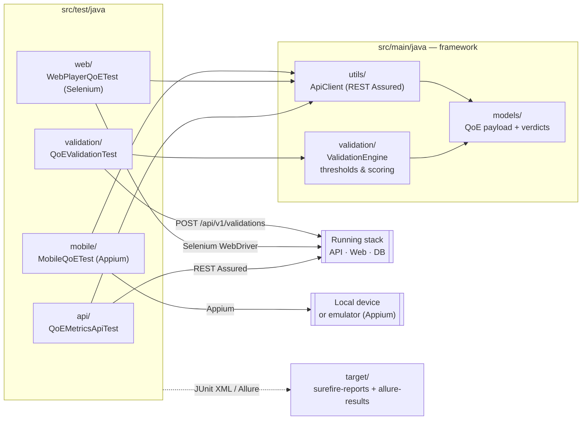

# QoE Automation Tests

Java / TestNG cross-platform end-to-end suite that exercises the live API, the running web player, and (optionally) connected mobile devices via Appium.

## Tech stack

| Layer | Technology |
|---|---|
| Language | Java 21+ |
| Test runner | TestNG |
| API testing | REST Assured |
| Web testing | Selenium WebDriver |
| Mobile testing | Appium |
| Build | Maven |
| Reports | Surefire XML + Allure |

## Module architecture

The framework is laid out as a small library plus a TestNG test tree per platform. The library (`src/main`) holds reusable building blocks (`ApiClient`, `ValidationEngine`, models); the tests (`src/test`) are grouped by surface (api / web / mobile / validation).



## Prerequisites

- Java 21+
- Maven 3.8+
- Backend API running on port 8080
- For web tests: ChromeDriver matching your Chrome version
- For mobile tests: Appium server running, connected device or emulator

## Setup

```bash
cd qoe-automation-tests
mvn dependency:resolve
```

Edit `src/test/resources/test-config.properties` to point at your stack:

```properties
api.base.url=http://localhost:8080/api/v1
web.player.url=http://localhost:3000
mobile.platform=android
appium.server.url=http://localhost:4723
test.timeout.seconds=30
```

## Running tests

```bash
mvn test                                                     # all tests
mvn test -DsuiteXmlFile=src/test/resources/testng.xml        # parallel TestNG suite
mvn test -DsuiteXmlFile=src/test/resources/testng-mobile.xml # mobile suite

# Single class
mvn test -Dtest=QoEMetricsApiTest
mvn test -Dtest=QoEValidationTest
mvn test -Dtest=WebPlayerQoETest
mvn test -Dtest=MobileQoETest

# Skip a class
mvn test -Dtest='!MobileQoETest'

# By TestNG group
mvn test -Dgroups=api
mvn test -Dgroups=validation
mvn test -Dgroups=mobile
```

## Reports

```bash
# Surefire (JUnit XML — used by CI)
ls target/surefire-reports/TEST-*.xml

# Surefire HTML report
mvn surefire-report:report
open target/site/surefire-report.html

# Allure (richer test detail)
mvn allure:report
allure serve target/allure-results --port 5055
```

## CI integration

Two workflows consume this suite:

| Workflow | Job | Trigger |
|---|---|---|
| [`stream-qoe-app-validation.yml`](../.github/workflows/stream-qoe-app-validation.yml) | `qoe-test-framework` | every push / PR |
| [`stream-qoe-app-release.yml`](../.github/workflows/stream-qoe-app-release.yml) | `acceptance-automation` | manual release gate |

Both call [`junit_to_summary.py`](../.github/scripts/junit_to_summary.py) to turn the Surefire XML into a GitHub step summary and a Slack notification.

## Project structure

```
qoe-automation-tests/
├── src/
│   ├── main/java/com/devopsdays/qoe/framework/
│   │   ├── validation/          # ValidationEngine — thresholds + scoring
│   │   ├── models/              # Shared data models
│   │   └── utils/               # ApiClient, retry helpers
│   └── test/java/com/devopsdays/qoe/tests/
│       ├── api/                 # QoEMetricsApiTest — REST Assured
│       ├── web/                 # WebPlayerQoETest — Selenium
│       ├── mobile/              # MobileQoETest — Appium
│       └── validation/          # QoEValidationTest — threshold validation
├── src/test/resources/
│   ├── testng.xml               # Suite config (parallel groups, listeners)
│   ├── testng-mobile.xml        # Mobile-only suite
│   └── test-config.properties   # URLs, timeouts, platform selection
└── pom.xml
```

_(CI pipeline validation: documentation-only edit on branch `demo/actions-pipeline-smoke`.)_
