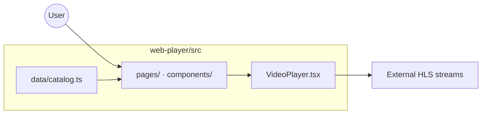

# Web Player

React / TypeScript HLS streaming app (StreamApp) with catalog browsing, video playback, and Playwright E2E tests.

_Validation: Web module PR pipeline (Vitest · Playwright BAT/smoke · DevSecOps · ephemeral · PR comment)._

## Tech stack

| Layer | Technology |
|---|---|
| UI | React 18, TypeScript |
| Video | HLS.js |
| Build | Vite |
| Unit tests | Vitest (jsdom) |
| E2E tests | Playwright (Chromium) |
| Reports | Allure |

## Module architecture

Catalog pages (`BrowsePage`, `DetailPage`, `HomePage`) feed a `VideoPlayer` component that wraps `<video>` and HLS.js. Playwright BAT/Smoke tests use `data-testid` selectors and the `<video>` element API.



## Prerequisites

- Node.js 20+
- npm 9+
- Optional: Docker stack for `e2e:docker` (`docker compose up -d`)

## Setup

```bash
cd web-player
npm install
```

## Running the app

```bash
npm run dev    # http://localhost:5173
```

Docker/nginx: **http://localhost:3000** when the full stack is up.

## Tests

### Unit (Vitest)

```bash
npm test
npm run allure:serve:unit    # http://127.0.0.1:5050
```

### E2E (Playwright)

```bash
npm run e2e:install          # first time — Chromium

npm run e2e:bat              # BAT (@BAT) — local Vite preview
npm run e2e:smoke            # Smoke (@Smoke)

# Against Docker web player
PLAYWRIGHT_BASE_URL=http://localhost:3000 npm run e2e:bat

npm run allure:serve:bat     # http://127.0.0.1:5051
```

### Reports

```bash
npm run allure:unit          # generate unit HTML
npm run allure:bat           # generate BAT HTML
npm run report               # Playwright HTML (e2e stage)
```

## Build

```bash
npm run build
```

## Project structure

```
web-player/
├── src/
│   ├── components/      # VideoPlayer, Navbar, Carousel, …
│   ├── pages/           # HomePage, BrowsePage, DetailPage
│   └── data/            # catalog.ts, catalog-images.ts
├── e2e/                 # Playwright specs (@BAT · @Smoke)
├── playwright.config.ts
├── Dockerfile
└── package.json
```

<!-- ci: triggers streaming-app-web.yml on PR -->
